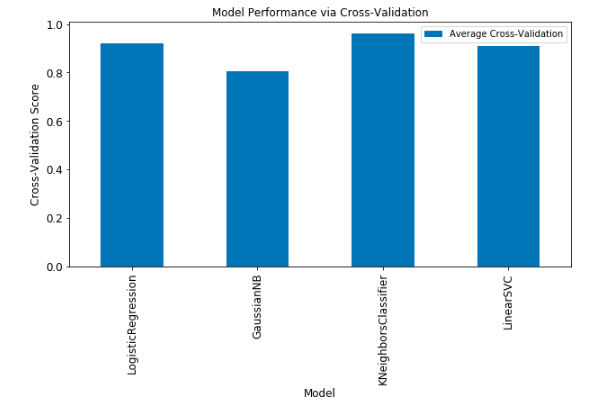

# Machine Learning Code Snippets 

The idea of these notebooks is to put together in one place a set of useful code snippets for model comparison.

These notebooks are a **work in progress** which will be updated weekly.

A simple example of model comparison is shown in the figure below:

