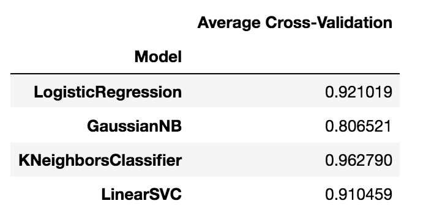

# Machine Learning Code Snippets 

                   
      
<br>

<br>
<br>
<p align="center">
  
</p>
<br>


<p align="center">
  <a href="#cwa"> (1) Choosing which algorithm works best for a given dataset </a> •
  <a href="#comb"> (2) Selecting the model input features trying all possible combinations </a>
</p>

<a id = 'cwa'></a>
## 1) Choosing which algorithm works best for a given dataset

For this item I will use the `digits` dataset, which is included in scikit-learn.

### 1.1) Making imports and loading digits dataset

```
import numpy as np
import pandas as pd
from IPython.core.interactiveshell import InteractiveShell
InteractiveShell.ast_node_interactivity = "all" # see the value of multiple statements at once.
pd.set_option('display.max_columns', None)
import pylab
from matplotlib import pyplot as plt
import seaborn as sns
from sklearn import linear_model
import seaborn as sns
import math
import itertools
```
Now loading the dataset:
```
from sklearn.datasets import load_digits
digits = load_digits()
X,y = digits.data, digits.target
```

### 1.2) Train/test split

```
from sklearn.model_selection import train_test_split
from sklearn import model_selection, metrics
X = digits.data
y = digits.target
X_train, X_test, y_train, y_test = model_selection.train_test_split(X, y,
                            test_size=0.25, random_state=0)
```

### 1.2) Comparing Models using the `f1-score`

To compare the models we will choose as our metric the `f1_score`. We can [write](https://www.scipy-lectures.org/packages/scikit-learn/index.html#supervised-learning-classification-of-handwritten-digits) a `for` loop that does the following:
- Iterates over a list of models, in this case, ` GaussianNB`, `KNeighborsClassifier` and `LinearSVC`
- Trains each model using the training dataset `X_train` and `y_train`
- Predicts the target using the test features `X_test`
- Calculates the `f1_score` comparing with `y_test`
- Note that the hyperparameters used for the three estimators are the default values

Note that we are iterating over a list of classes and the `( )` is inside the loop. The first loop is:

    LogisticRegression().fit(X_train, y_train)
    
an so on. Also using `.__name__` transforms the `LogisticRegression` into a string:

    type(LogisticRegression.__name__) --> str

```
from sklearn.linear_model import LogisticRegression
from sklearn.naive_bayes import GaussianNB
from sklearn.neighbors import KNeighborsClassifier
from sklearn.svm import LinearSVC
def f1_score_comparison(models,X_train,X_test,y_train,y_test):
    for model in models:
        clf = model().fit(X_train, y_train)
        y_pred = clf.predict(X_test)
        f1 = metrics.f1_score(y_test, y_pred, average="macro")
        print('%s: %s' % (model.__name__, round(f1,3)))
    return
    
models_list = [LogisticRegression, GaussianNB, KNeighborsClassifier, LinearSVC]

f1_score_comparison(models_list,X_train,X_test,y_train,y_test)
```

<br>
<br>
<p align="center">
  
</p>
<br>


We see that for the digits dataset and using the `f1_score` as metric, `KNeighborsClassifier` was the best classifier

### 1.3) Comparison using cross-validation

The cross-validation procedure is nicely illustrated below:

<br>
<br>
<p align="center">
  
</p>
<br>

```
from sklearn.model_selection import cross_val_score
lst_av_cross_val_scores = []
for model in models:
    clf = model()
    cross_val_scores = (model.__name__, cross_val_score(clf, X, y, cv=5))
    av_cross_val_scores = list(cross_val_scores)[1].mean()
    lst_av_cross_val_scores.append(av_cross_val_scores)

model_names = [model.__name__ for model in models]

df = pd.DataFrame(list(zip(model_names, lst_av_cross_val_scores)))
df.columns = ['Model','Average Cross-Validation']

df.set_index('Model', inplace=True)

ax = df.plot(kind='bar', title ="Model Performance via Cross-Validation", figsize=(8, 8), fontsize=12)
ax.set_xlabel("Model", fontsize=12)
ax.set_ylabel("Cross-Validation Score", fontsize=8);
plt.show()
```

<br>
<br>
<p align="center">
  
</p>
<br>


Putting this into a function:
```
def cross_val_comparison(models,X_train,X_test,y_train,y_test):
    
    lst_av_cross_val_scores = []

    for model in models:
        clf = model()
        cross_val_scores = (model.__name__, cross_val_score(clf, X, y, cv=5))
        av_cross_val_scores = list(cross_val_scores)[1].mean()
        lst_av_cross_val_scores.append(av_cross_val_scores)
        model_names = [model.__name__ for model in models]

        df = pd.DataFrame(list(zip(model_names, lst_av_cross_val_scores)))
        df.columns = ['Model','Average Cross-Validation']
        df.set_index('Model', inplace=True)

    return df
```


<br>
<br>
<p align="center">
  
</p>
<br>


We see that for the digits dataset and now using the cross-validation as metric, `KNeighborsClassifier` still is the best classifier.


<a id = 'comb'></a>
## 2) Selecting the model input features trying all possible combinations

Using the dataset from [one of my other projects](https://github.com/marcotav/retail-store-expansion-analysis-with-lasso-and-ridge-regressions/blob/master/README.md) the following code generates all combinations of useful relevant features using the `itertools` module. The candidate features are:
```
features = ['num_stores','population', 'store_population_ratio', \
 'consumption_per_capita',  'stores_per_area', u'per_capita_income']
```
We now define the predictors and the target:
```
X,y = df[features], df['sale_dollars']
```
and perform a train-test split:
```
X_train, X_test, y_train, y_test = train_test_split(X, y, test_size=.3)
```
To generate combinations of features we use:
```
combs = []
for num in range(1,len(features)+1):
    combs.append([i[0] for i in list(itertools.combinations(features, num))])
```
The code below makes a list of `r2` combinations and finds the best predictors using `itemgetter`:
```
lr = linear_model.LinearRegression(normalize=True)
ridge = linear_model.RidgeCV(cv=5)
lasso = linear_model.LassoCV(cv=5)
models = [lr,lasso,ridge]
r2_comb_lst = []
for comb in combs:        
    for m in models:
        model = m.fit(X_train[comb],y_train)
        r2 = m.score(X_test[comb], y_test)
        r2_comb_lst.append([round(r2,3),comb,str(model).split('(')[0]])
        
r2_comb_lst.sort(key=operator.itemgetter(1))
```
The best predictors were then obtained via:
```
r2_comb_lst[-1][1]
```
## To be continued
